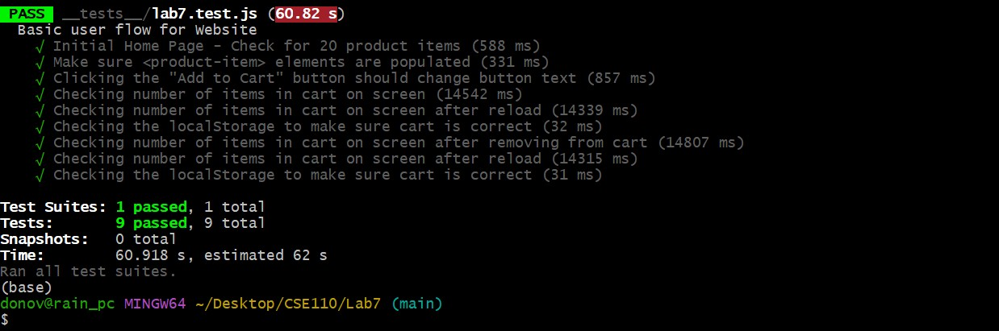

# Lab 7  
**Sarah Chun & Rain van Eetveldt**

---

## Question 1

Automated tests are most effective when they run consistently and early in the development process. Running them in a GitHub Action on every push ensures that tests run automatically, code is validated before merging, and bugs are caught early.

---

## Question 2

No, checking the return of a function is an example of a unit test. E2E tests are designed to simulate and test the flow of the application, from start to finish. They include UI interactions, such as clicking buttons, navigating the webpage, and filling in forms.

---

## Question 3

Navigation mode in Lighthouse reloads the page and analyzes it as it loads. This mode is useful for understanding the user experience during a first-time visit because it measures key performance metrics like load time, interactivity, and rendering. In contrast, snapshot mode analyzes the page in its current state without reloading. It does not measure performance-related metrics like load time or interaction timing because it only sees the static DOM at a single moment. Snapshot mode is generally used for checking the accessibility and SEO of a website.  

---

## Question 4

4) Name three things we could do to improve the CSE 110 shop site based on the Lighthouse results.

1. Performance: The images of the shop can be resized to cut down on the amount of bytes of information that need to be sent over the network to load the page because some images are larger than their displayed sizes (meaning more information is being sent than is needed).  
2. Accessibility: A lang attribute can be added to the page to help screen readers interpret and pronounce the text correctly, improving accessibility for users with visual impairments. It can also support translation tools and contribute to better SEO by signaling the page's language to search engines.
3. Performance/Best Practices: Adding a <meta name="viewport"> tag with width or initial-scale ensures the page scales correctly on mobile devices, enabling responsive design and improving readability. Without it, the page may appear zoomed out and be less mobile-friendly.   

---

### Test Results

